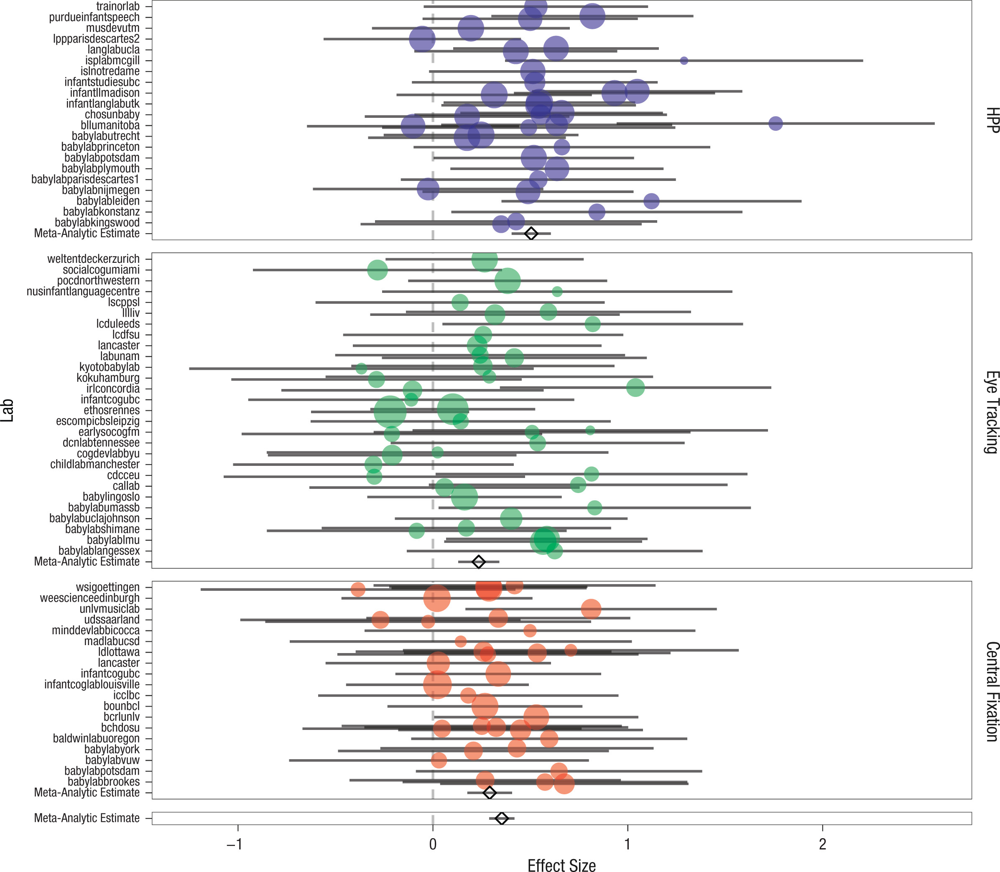
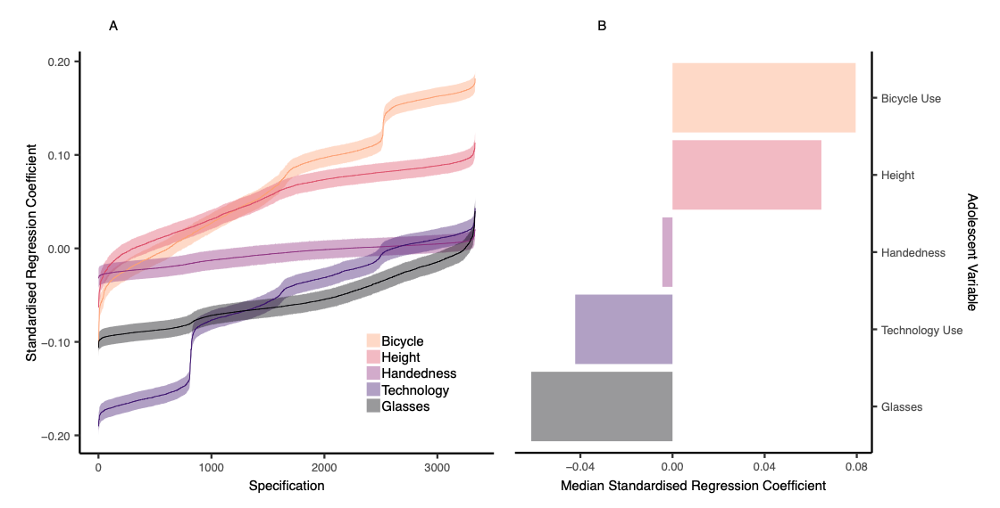
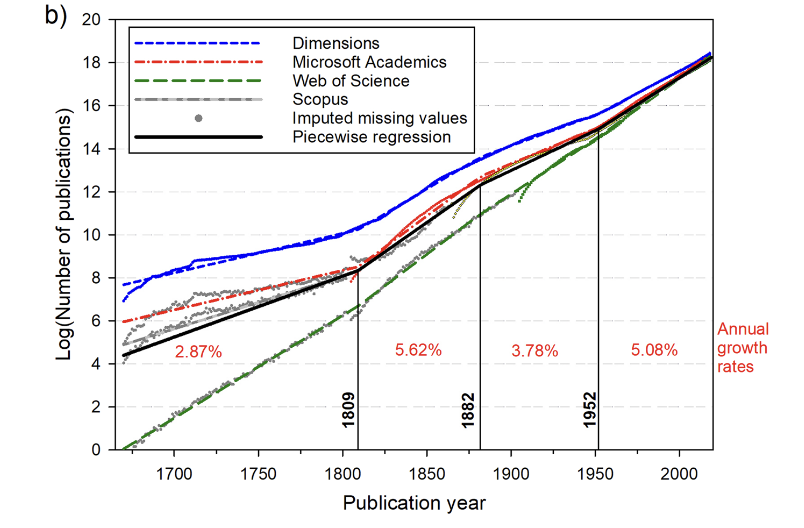
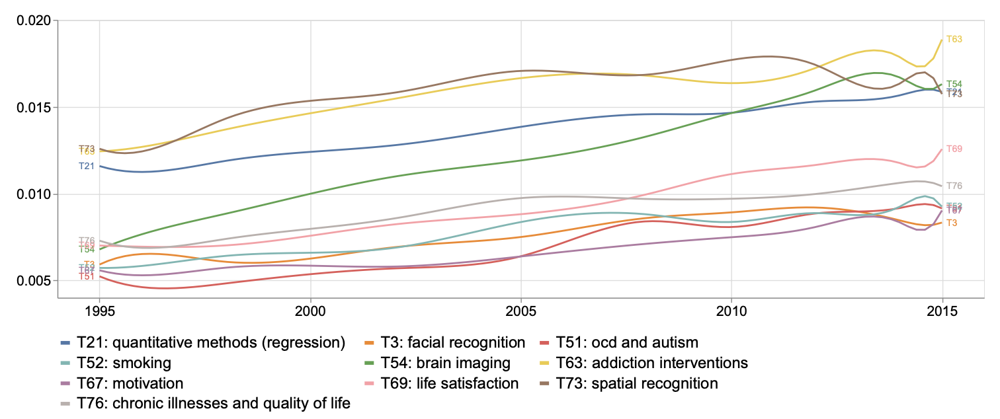
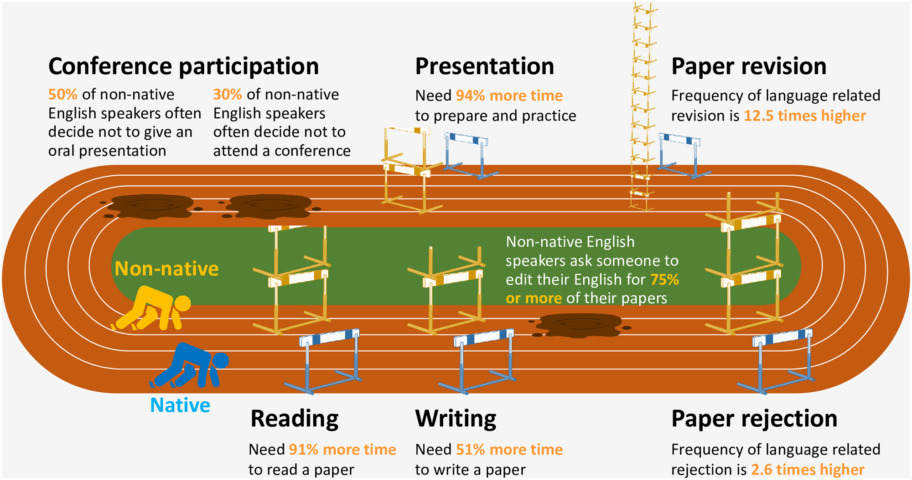
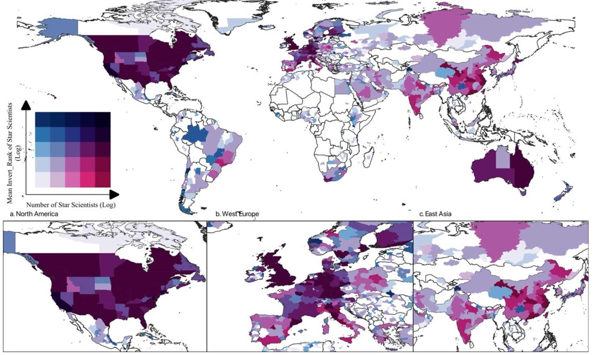
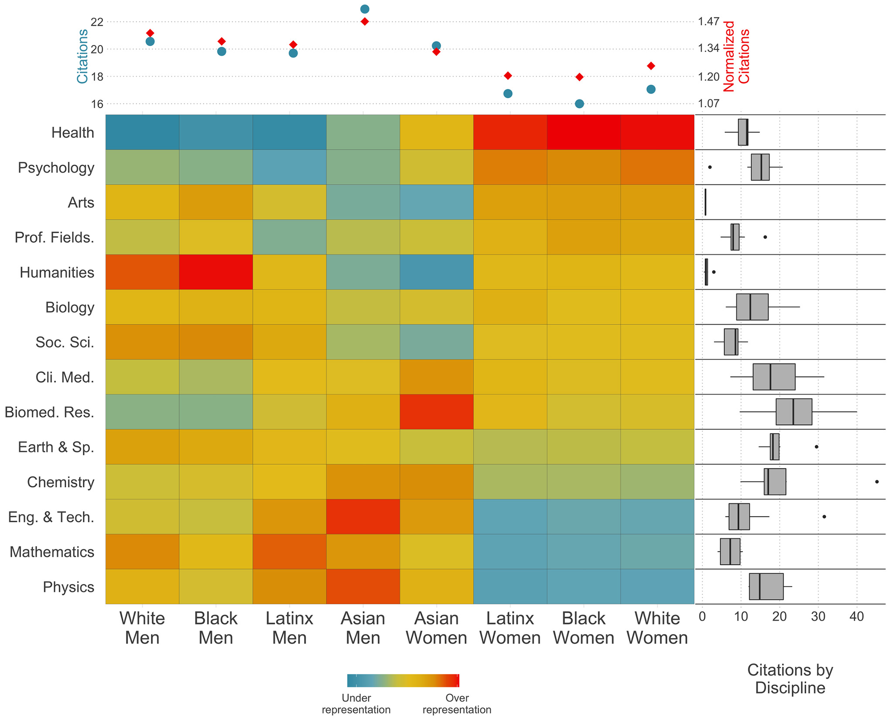
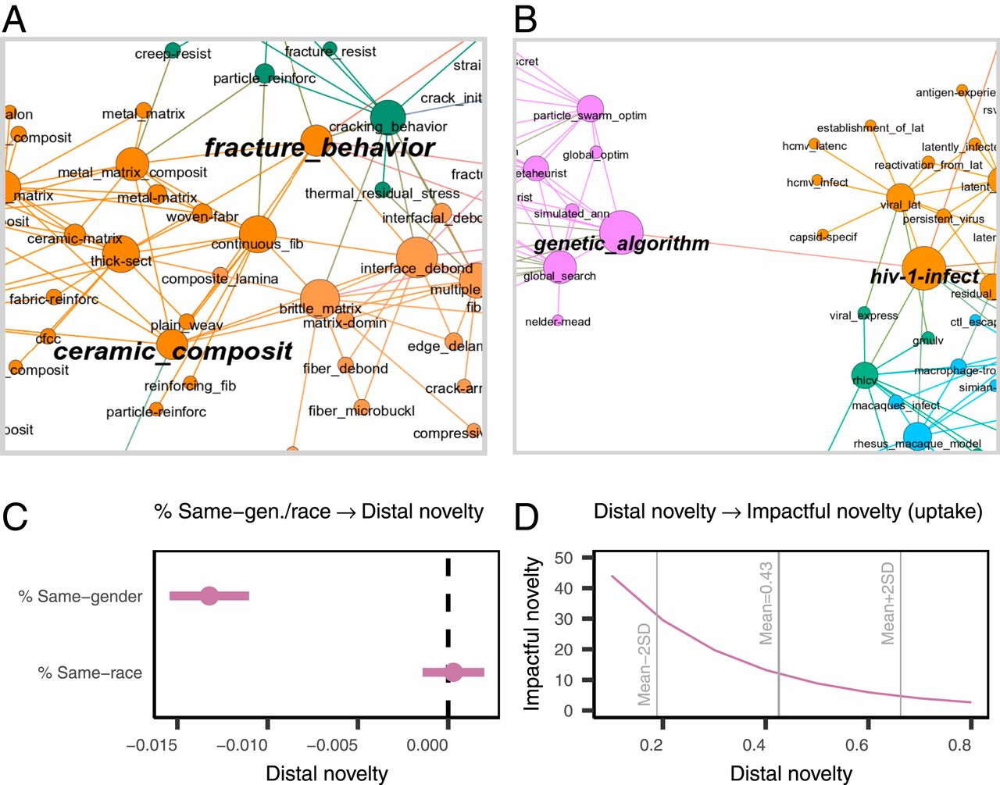

```{r}
#| label: setup
#| eval: true
#| echo: false
library(ggraph)
library(igraph)
library(magick)
library(rcartocolor)
library(tidygraph)
library(tidyverse)

core_vars <- c("BNC_Written_Freq_AW", "PCREFp", "PCDCp", "DRPVAL", "RDFRE")

texts <- read_csv("2026-06-24_all-studies-texts-candidate-and-presented-texts-text-properties.csv",
                   show_col_types = FALSE)

source("person-grid.R")
source("concept-map.R")
source("testing-sequence.R")
source("sampling-distributions.R")
source("peer-review-workflow.R")
```

## We are learning how to think critically for ourselves

*Active learning* works best even if it sometimes feel challenging

- Active learning is what you do when you ask or answer questions 
- We will prompt you sometimes with [Activate]{style="color: red;"}

::: {.callout-important title="Activate"}
Can you a picture a Psychologist? What do they look like? What kind of place do they work in?
:::

## What we are going to do {background-color="#CDFFDF"}

We are going to engage with big ideas and difficult questions

1.  **Being a psychologist:** How *should* we do science, how *do* we do science?
2.  **How we try not to fool ourselves:** The logic of the scientific method, and how we should use it
3.  **Why this is harder in Psychology:** People are semi-random, words are slippery, we can't look inside everyone's heads
4.  **Science as a thing that is done by people:** History, community, inequity, and diversity

## Big ideas and difficult questions

- What is science?
- How do we do it?

## Science versus pseudoscience

We are surrounded by *pseduoscientific* claims and it's hard to know what to believe. What is the difference between

1. *Scientific* claims like: phonics are a good way to learn to read
2. *Pseudoscience* claims like: vaccination causes Autism

::: {.callout-tip title="Reading"}
@sep-pseudo-science presents a good outline of the issues
:::

## Am I a crank or what?

- The problem is that *pseudoscience* can be presented to look like science and *cranks* can talk like scientists
- How do we tell the difference?
- @Bright2023: the difference does not lie in whether we are right or wrong, doing good science or bad
- The difference lies in *communism* [@Merton1942]

::: {.callout-important title="Activate"}
What psychological claims do you see online are *pseudoscientific*?
:::

## Communism, universalism, disinteredness, organized skepticism

@Merton1942 sees the *ethos* of modern science as including:

- **Communism:** make your work freely available to others, and open to evaluation
- **Universalism:** evaluate ideas independent of who their sources are
- **Disinterestedness:** evaluate ideas based on evidence or reason, not preferences or interests
- **Organised skepticism:** suspension of judgment, openness to being wrong

## Doing science versus bullshitting

The difference between *science* and *pseudoscience* is like the difference between liars and bullshitters [@Hicks2024]:

- Liars give you a statement they know to be false, with the intention to deceive you
- Bullshitters *do not care* about the truth of their statements, whether or not they intend to deceive you about what they think

::: {.callout-tip title="AIs as bullshit machines"}
@Hicks2024 argue that AIs like ChatGPT *can **not*** intend truths
:::

## Careful observations organized to enable reasoning

If we *do care* about the truth, how do we get to it?

- We have, at least since the Greek philosopher Aristotle, thought that we needed careful observations organized so that we can think effectively *reason* about them

::: {.callout-tip title="Reading"}
@sep-scientific-method presents a good outline of the issues
:::

## What will our reasoning involve?

Most of the time, the forms of reasoning we use go in one of two directions

1.  **Induction** $\rightarrow$ From observations to fundamental and general insights, regularities or principles
2.  **Deduction** $\rightarrow$ To observations or tests, from fundamental and general insights, regularities or principles

## Being capable of being wrong

Maybe the core idea many psychological scientists assume about our work as scientists is that we must be **capable of being wrong:** roughly, this involves

1. Assuming a theory about the world or about people
2. Specifying a prediction that the theory implies, and testing it

::: {.callout-tip title="Reading"}
But why is it being capable of being *wrong* that matters? We see the idea of **falsification** in the thinking of @popper2005, as it is discussed by @meehl1990
:::

## The history of science

- In thinking about science, it is useful to keep in mind the difference between (1.) what we think people *should* do [@Merton1942; @popper2005] and (2.) what we *actually* do
- This leads us to think about history or the sociology of science in ways that are enlightening, especially when we want to engage with messy realities

::: {.callout-tip title="Reading"}
If you have heard the words "paradigm shift" then you have been affected by Thomas Kuhn's ideas about the history of science [@kuhn1970]: we talk about these, next
:::

## The normal business of science: solving puzzles

- Most of the time, scientists, working as members of a community or a tradition, work within a *shared understanding* of:

  - what problems are worth investigating
  - what solutions are possible
  - what methods can be used

- In the context of this **paradigm** [@kuhn1970], the scientist can spend their time figuring out solutions to the uncertainties that remain: *solving puzzles*

## Anomalies and revolutionary change

But over time scientists may come to see a [@kuhn1970]:

> ... persistent failure of the puzzles of normal science to come out as they should

A time of *crisis* ensues, leading to rejection of one paradigm, and acceptance of another

::: {.callout-tip title="Reading"}
In Psychology, we have been through our own crises and now work in a revolutionary moment [@vazire2018]: the *credibility revolution*
:::

## Big ideas and difficult questions {background-color="#96DED1"}

::: {.callout-important title="Activate"}
What is the *next* revolution for psychological science? Are we already there?
:::

## The *hardest* science: Why learning about people is hard {background-color="#CDFFDF"}

You will learn about *revolutionary* new ways of doing psychological science

- We will talk about

  - open science practices
  - reproducibility
  - requirements for building credible knowledge

- But why this revolution became necessary is worth thinking about

## The *hardest* science: Why learning about people is hard

@srivastava2009 argues:

- Hard problems are embedded in complex systems
- Hard problems vary by local conditions
- Hard problems are difficult to quantify

  - [*This* is why Psychology is **so challenging and so exciting**]{style="color: red;"}

## People vary, diverse in who we are, what we think and how we behave

```{r}
#| label: fig-diversity-sample
#| fig-cap: "The people in any group will vary in many ways: just look around you"
#| fig-alt: !expr diversity_grid$alt_text
#| fig-width: 8
#| fig-height: 4.5

diversity_grid <- person_grid(n = 125, seed = 11)
diversity_grid$plot
```

## We can *never* test all the people on all the things

```{tikz}
%| label: fig-sampling-diagram
%| fig-align: center
%| fig-cap: "Normally, when we do psychological studies, we ask a sample of people to respond to a sample of stimuli"
%| engine.opts:
%|   extra.preamble:
%|     - "\\usepackage[dvipsnames]{xcolor}"
%|     - "\\usetikzlibrary{backgrounds}"
%|     - "\\usepackage{amsmath,amssymb,bm}"
%|     - "\\usepackage{graphicx}"
%|     - "\\usetikzlibrary{calc}"
\def\diagshift{0}

\begin{tikzpicture}[
    font=\large\sffamily,
    background rectangle/.style={fill=white}, show background rectangle
    ]

  \begin{scope}[scale=1.3, transform shape]

  \node[draw=black!40, thick, minimum width=6cm, minimum height=4.5cm,
        rounded corners=10,
        label={[label distance=1cm, font=\normalsize\sffamily\bfseries]%
               above:\textbf{Sample from readers $i$}}]
        (Pmain) at (\diagshift + 0, 0) {};
  \node[draw=black!40, thick, minimum width=6cm, minimum height=4.5cm,
        rounded corners=10,
        label={[label distance=1cm, font=\normalsize\sffamily\bfseries]%
               above:\textbf{Sample from texts $j$}}]
        (Tmain) at (\diagshift + 8, 0) {};
  \node[draw=black!40, thick, minimum width=6cm, minimum height=4.5cm,
        rounded corners=10,
        label={[label distance=1cm, font=\normalsize\sffamily\bfseries]%
               below:\textbf{Sample from questions $k$}}]
        (Qmain) at (\diagshift + 4, -6) {};

  \begin{scope}[shift={(Pmain.south west)}, xscale=4.75, yscale=4.75]
    \foreach \x/\y in {-0.018/0.744, 0.181/0.652, 0.524/0.774, 0.642/0.605,
                        -0.008/0.336, 0.388/0.418, 0.520/0.459, 0.585/0.270}
      { \fill[YellowGreen!80!black!95, draw=black, thick]
          (\x*1.3+.25,\y*1.3-.2) circle (2pt); }
    \foreach \x/\y in {0.047/0.580, 0.325/0.743, 0.146/0.475, 0.290/0.530,
                        0.437/0.582, 0.341/0.297, 0.636/0.393, 0.146/0.339}
      { \fill[CornflowerBlue!40, draw=black, thick]
          (\x*1.3+.25,\y*1.3-.2) circle (2pt); }
  \end{scope}

  \begin{scope}[shift={(Tmain.south west)}, xscale=4.75, yscale=4.75]
    \foreach \x/\y in {1.290/0.728, 1.665/0.467, 1.773/0.257,
                        1.214/0.320, 1.158/0.515}
      { \fill[YellowGreen!80!black!95, draw=black, thick]
          (\x*1.3-1.35,\y*1.3-.2) circle (2pt); }
    \foreach \x/\y in {1.484/0.795, 1.566/0.561, 1.265/0.595, 1.399/0.605,
                        1.822/0.430, 1.572/0.684, 1.718/0.651, 1.822/0.743,
                        1.590/0.366, 1.399/0.257, 1.318/0.430}
      { \fill[CornflowerBlue!40, draw=black, thick]
          (\x*1.3-1.35,\y*1.3-.2) circle (2pt); }
  \end{scope}

  \begin{scope}[shift={(Qmain.south west)}, xscale=4.75, yscale=4.75]
    \foreach \x/\y in {0.05/0.74, 0.20/0.65, 0.52/0.77,
                        0.64/0.60, 0.10/0.34, 0.39/0.42}
      { \fill[YellowGreen!80!black!95, draw=black, thick]
          (\x*1.3+.25,\y*1.3-.2) circle (2pt); }
    \foreach \x/\y in {0.15/0.58, 0.33/0.74, 0.14/0.47, 0.29/0.53,
                        0.44/0.58, 0.34/0.30, 0.63/0.39, 0.15/0.34}
      { \fill[CornflowerBlue!40, draw=black, thick]
          (\x*1.3+.25,\y*1.3-.2) circle (2pt); }
  \end{scope}

  \coordinate (dotj) at (\diagshift + 0.5, 1.4);
  \fill[CornflowerBlue!40, draw=black, thick] (dotj) circle (3.5pt);
  \node[above=3pt, font=\small\sffamily\bfseries] at (dotj) {$j$};

  \coordinate (doti) at (\diagshift + 8.0, 1.4);
  \fill[CornflowerBlue!40, draw=black, thick] (doti) circle (3.5pt);
  \node[above=3pt, font=\small\sffamily\bfseries] at (doti) {$i$};

  \coordinate (dotk) at (\diagshift + 4.0, -5.6);
  \fill[CornflowerBlue!40, draw=black, thick] (dotk) circle (3.5pt);
  \node[above=3pt, font=\small\sffamily\bfseries] at (dotk) {$k$};

  \draw[thick,-latex] (dotj) -- (doti)
      node[midway, above=25pt, font=\small\sffamily, align=center]
      {Reader responds to text stimulus};
  \draw[thick, dashed, -latex] (dotk) -- (dotj);
  \draw[thick, dashed, -latex] (dotk) -- (doti);
  \node[right=0.15cm, font=\small\sffamily, align=left]
      at (\diagshift + 5.5, -3.1)
      {Reader responds to\\[-2pt]question about text};

  \draw[thick]
      (\diagshift - 3.3,  2.25) -- (\diagshift - 3.7,  2.25)
      -- (\diagshift - 3.7, -8.25) -- (\diagshift - 3.3, -8.25);
  \node[left=3pt, align=right, font=\small\sffamily\bfseries]
      at (\diagshift - 3.7, -3)
      {\textbf{Joint}\\[-3pt]\textbf{sample}};

  \node[anchor=west,
        label={[font=\small\sffamily]right:Unit not sampled}]
      at (\diagshift - 3.4, -10.0)
      {\tikz\fill[YellowGreen!80!black!95, draw=black, thick]
                  (0,0) circle (4pt);};
  \node[anchor=west,
        label={[font=\small\sffamily]right:Unit sampled}]
      at (\diagshift - 3.4, -10.7)
      {\tikz\fill[CornflowerBlue!40, draw=black, thick]
                  (0,0) circle (4pt);};

  \end{scope}

\end{tikzpicture}
```

## People vary in how they respond

```{r}
#| label: fig-effect-grid-intro
#| fig-cap: "Different people will often respond in different ways: from strongly negative (dark blue) through non-responsive (near-white) to strongly positive (dark red)"
#| fig-alt: !expr effect_grid$alt_text
#| fig-width: 8
#| fig-height: 4.5

set.seed(2716)
effect_grid <- person_grid(
  n = 60,
  mode = "value",
  value = rnorm(60, mean = 0, sd = 1.2)
)
effect_grid$plot
```

## We will work with data but numbers impose limits

We often work with *quantitative data*, numbers we record

- Data collection methods have to be repeatable $\rightarrow$ we need standardization
- We often identify categories of people or behaviours $\rightarrow$ classification involves choices
- Data need to be capable of summary $\rightarrow$ we ignore context

## We need to be aware of these limits

We can learn to work ably with quantitative data but that ability must come with *awareness* of the limits[@Nguyen2024]

- To make data collection repeatable and observations capable of summary, we have to leave things out, stripping out context, and making classification choices that sometimes reflect biases or blindspots

::: {.callout-important title="Activate"}
Can you see the problems?: What about diagnostic categories? What about classification of gender, ...?
:::

<!-- ## *And* qualitative approaches in psychological science

You will learn about *qualitative data* methods: this may involve 

- Systematic approaches to exploring and interpreting interview transcripts or written text to understand meaning, experience, and social or psychological patterns
- Learning to reflect on the impact of your perspective, or position, as observer and interpreter
- Learning to examine the assumptions that underly the generalizability of your claims -->

## You are entering a field that has been through a period of revolution 

The effects of revolution are present everywhere we do teaching and learning: Simine Vazire calls this the *credibility revolution* [@vazire2018]. You will see it in our

- Emphasis on *transparency* or *open science*, so our procedures, materials, data and code are open to scrutiny
- Focus on *reproducibility*, so that our research can be verified
- Commitment to *integrity*

## How we think about and teach Psychological science is different now

- These changes have taken a while [@gelmanWhyDidIt2021] 
- but now represent the dominant culture in research-intensive universities (like Lancaster)
- These changes mean that *critical reflection* has a stronger role, now, for staff *and* students

::: {.callout-tip title="Reading"}
@gelmanWhyDidIt2021 and @vazire2018 are a good place to start but @Gelman2016 presents a *fierce* account
:::

## Meehl's thinking underlies the reforms in psychological science

Paul Meehls' writings are interesting and *funny*. We learn from him that we should

- Be specific in the theory predictions that we test
- Understand that we will learn more when data *contradict our predictions*
- Than we can learn if observations match our predictions

::: {.callout-tip title="Reading"}
Meehl wrote important and now-influential papers, including @meehl1990
:::

## Doing science and the importance of falsification

@meehl1990 built on @popper2005 to argue that we need to be careful about the *logic*

::: {.callout-tip title="The logic"}
If we assume a theory $T$ that predicts some observation $O$, we might be tempted to follow this logic:

1. If $T$ then $O$
2. Observe $O$
3. Decide $T$ is right

- But we would be mistaken (or at least *weakly* right) because there are so many possible reasons why we might see $O$
:::

## Doing science and the importance of falsification

@meehl1990 built on @popper2005 to argue that we need to be careful about the *logic*

::: {.callout-tip title="The logic"}
If we assume a theory $T$ that predicts some observation $O$, we *can* safely follow this logic:

1. If $T$ then $O$
2. Observe not-$O$
3. Decide $T$ is wrong

- This is *falsification* and it works because theory $T$ does not work if its prediction does not work: this logic is called *modus tollens* or the method of destruction
:::

## The logic {background-color="#96DED1"}

::: {.callout-important title="Activate"}
It is not easy to think about the logic of science. That is true for everyone

- Respond to this element by trying to think of an example where you or someone you know has made a prediction (e.g., if you say that thing it will have that reaction) and then tested it (by saying the thing)
- Reflect on how your thinking was working then
:::

## Theories and theory-like objects {background-color="#CDFFDF"}

If only it were that easy

## Theories and theory-like objects

- @vanrooij2022 points out that sometimes there are things that we call theories even though they are not theories
- Language is *slippery* so we need to be careful

::: {.callout-tip title="Theories and not theories"}
Theories:

- Represent a thing we want to explain, a target like the mind 
- In terms of a model, expressed in language, or images, or formal symbols
:::

## Theories and theory-like objects

::: {.callout-tip title="Theories and not theories"}
Theories are not:

- Stories or narratives we might use to describe what we are thinking about
- An acronym or collection of words or a one-word explanation
- A statistical model or data description or summary
:::

## Auxiliary theories

@meehl1990 explains that (1.) given a theory (2.) to make predictions we can test (3.) we often need *auxiliary theories*

::: {.callout-tip title="Auxiliary theories"}
- If our theories are about how brains work or about psychological processes
- Then we also have to think about the way that a psychological process is linked to the behaviours we can observe
- Things like response production mechanisms
:::

## We need to be *specific* in predictions

To get to a prediction we can test then, we need:

- A psychological theory about a process or a thing
- Auxiliary assumptions that gets us from the process or thing to what we can observe
- A specific account of what *exactly* we are predicting: is the behaviour going to increase or decrease, and by how much?

## The theory is not the hypothesis is not the statistical test result

::: {.callout-tip title="It will help you to keep these things separate"}
- **Theories** are accounts of people and the things we do
- **Hypotheses** are based on theories, stated as predictions about how we vary
- **Test results** are aimed at hypotheses, based on observations about how people vary
:::

## The theory is not the hypothesis is not the statistical test result

```{r}
#| label: fig-theory-process-stats
#| fig-cap: "Different theories can imply the same process, and different processes can imply the same statistical test result"
#| fig-width: 9
#| fig-height: 5.0625

theory_columns <- list(
  c("Words we experience more often are easier to recall",
    "Frequency or age of experience does not matter to recall",
    "Words we experience early in life are easier to recall"),
  c("Neural network connection strength changes",
    "Neural word representation quality changes",
    "Word recognition decision-making strategy changes"),
  c("Experience correlates with word recognition speed",
    "Experience does not correlate with word recognition speed")
)
theory_titles <- c("Theories", "Process models", "Statistical tests")

# theories -> processes: many-to-many
# processes -> statistical models: every process links to both tests
theory_edges <- list(
  data.frame(from = c(1, 1, 2, 3, 3), to = c(1, 2, 3, 1, 2)),
  data.frame(from = rep(1:3, each = 2), to = rep(1:2, times = 3))
)

concept_map(theory_columns, theory_edges, theory_titles, arrows = FALSE, curvature = 0,
            edge_color = "#B0B0B0", edge_alpha = 0.45)$plot
```

## Given the logic, the challenges: Measurements are imperfect

We cannot look directly inside people's heads so we must rely on psychological measurements

::: {.callout-tip title="Validity $\sim$ @borsboom2004: Is our measure *valid*?"}
A test is valid if:

1. the thing exists and 
2. variations in the thing *causally* produce variations in measurement values
:::

## Given the logic, the challenges: Measurements are imperfect

We cannot look directly inside people's heads so we must rely on psychological measurements

::: {.callout-tip title="Reliability $\sim$ @revelle2019: Is our measure *reliable*?"}
"To what extent do scores measured at one time and one place with one instrument predict scores at another time or another place and perhaps measured with a different instrument?"
:::

## Given the logic, the challenges: Things vary, people vary

We often assume the same thing happens in the same way in everyone *but people vary* [@vasishth2021]

```{r}
#| label: fig-effect-grid-demo
#| fig-cap: "People vary and how conditions or interventions affect us will vary: from strongly negative (dark blue) to null (near-white) to strongly positive (dark red) impacts"
#| fig-alt: !expr effect_grid$alt_text
#| fig-width: 8
#| fig-height: 4.5

set.seed(2716)
effect_grid <- person_grid(
  n = 60,
  mode = "value",
  value = rnorm(60, mean = 0, sd = 1.2)
)
effect_grid$plot
```

## Given the logic, the challenges: People are kind of random

Let's imagine we test a person (you) on a psychological attribute like your vocabulary knowledge.

::: {.columns}

::: {.column width="50%"}
```{r}
#| label: fig-one-person-icon
#| fig-cap: "You do the vocabulary test"
#| fig-width: 4
#| fig-height: 3.75
#| echo: false

d_one <- simulate_vocab_data(n = 1, seed = 101)
testing_icons(n = 1, scores = d_one$observed_score)$plot
```
:::

::: {.column width="50%"}
```{r}
#| label: fig-one-score-dot
#| fig-cap: "We record your score"
#| fig-width: 4
#| fig-height: 3.75
#| echo: false

plot_dots(d_one$observed_score)
```
:::

:::

## Given the logic, the challenges: People are kind of random

Now imagine we test two people (you and your neighbour) using the same vocabulary test

::: {.columns}

::: {.column width="50%"}
```{r}
#| label: fig-two-people-icon
#| fig-cap: "Two people complete the test"
#| fig-width: 4
#| fig-height: 3.75
#| echo: false

d_two <- simulate_vocab_data(n = 2, seed = 102)
testing_icons(n = 2, scores = d_two$observed_score)$plot
```
:::

::: {.column width="50%"}
```{r}
#| label: fig-two-scores-dots
#| fig-cap: "We record two scores"
#| fig-width: 4
#| fig-height: 3.75
#| echo: false

plot_dots(d_two$observed_score)
```
:::

:::

## Given the logic, the challenges: We usually only test *samples* of people

Now imagine we test a *sample* of 29 people. Now we see a distribution of scores

::: {.columns}

::: {.column width="50%"}
```{r}
#| label: fig-sample-icons
#| fig-cap: "A sample of 20 people"
#| fig-width: 5
#| fig-height: 3.5
#| echo: false

testing_icons(n = 20, seed = 103)$plot
```
:::

::: {.column width="50%"}
```{r}
#| label: fig-sample-dotpile
#| fig-cap: "Their 20 scores: each point represents a person's score"
#| fig-width: 5
#| fig-height: 3.5
#| echo: false

d_sample <- simulate_vocab_data(n = 20, seed = 103)
plot_dotpile(d_sample$observed_score)
```
:::

:::

## Given the logic, the challenges: Fields of research involve many studies

If we ran the study again, we would draw a *different* sample of people each time

```{r}
#| label: fig-many-studies-icons
#| fig-cap: "Six studies, each with its own sample of 20 people"
#| fig-width: 12
#| fig-height: 6
#| echo: false

testing_icons_studies(n_studies = 6, n_per_study = 20, ncol = 3, seed = 104)$plot
```

## Given the logic, the challenges: Different samples of people will vary

No two samples look exactly alike, even when we're recruiting people from the same population, and testing everyone with the same procedure

```{r}
#| label: fig-many-studies-dotpiles
#| fig-cap: "Score distributions from the same six studies"
#| fig-width: 12
#| fig-height: 6
#| echo: false

studies_sample <- simulate_studies(6, 20, seed = 104)
plot_dotpile_grid(studies_sample, ncol = 3)
```

## The crud factor

::: {.columns}

::: {.column width="30%"}
- @meehl1990's *crud factor*: "everything correlates to some extent with everything else"
:::

::: {.column width="70%"}
```{r}
#| label: fig-crud-factor-network
#| fig-cap: "We can measure text structure prioperties in 100s of ways: Which ones matter?"
#| fig-width: 10
#| fig-height: 7.5
#| echo: false
text_data <- texts |>
  select(-text, -study, -implemented) |>
  mutate(across(everything(), ~as.numeric(scale(.))))

cor_mat <- cor(text_data, use = "pairwise.complete.obs")

cor_df <- as.data.frame(cor_mat) |>
  rownames_to_column("var1") |>
  pivot_longer(-var1, names_to = "var2", values_to = "correlation") |>
  filter(var1 != var2, var1 < var2)

threshold <- 0.3
edges <- cor_df |>
  filter(abs(correlation) >= threshold) |>
  rename(from = var1, to = var2, weight = correlation)

nodes <- data.frame(name = colnames(cor_mat))

graph <- tbl_graph(nodes = nodes, edges = edges, directed = FALSE) |>
  activate(edges) |>
  mutate(abs_weight = abs(weight)) |>
  activate(nodes) |>
  mutate(
    community = as.factor(group_louvain(weights = abs_weight)),
    degree    = centrality_degree(),
    highlight = name %in% core_vars
  )

set.seed(3927)
graph_filtered <- graph |> activate(nodes) |> filter(centrality_degree() > 0)
carto_div <- carto_pal(7, "TealRose")

ggraph(graph_filtered, layout = "fr", weights = abs_weight) +
  geom_edge_link(aes(color = weight, width = abs(weight)), alpha = 0.5) +
  geom_node_point(aes(color = community, size = degree), alpha = 0.85) +
  geom_node_point(data = ~filter(., highlight), color = "black", size = 1,
                   shape = 21, stroke = 1.2, fill = NA) +
  geom_node_text(aes(label = ifelse(highlight, name, "")), repel = TRUE,
                  size = 3.5, color = "black", fontface = "bold", max.overlaps = 30) +
  scale_edge_color_gradient2(low = carto_div[1], mid = carto_div[4], high = carto_div[7],
                              midpoint = 0, name = "Correlation") +
  scale_edge_width(range = c(0.1, 1.3), guide = "none") +
  scale_size(range = c(1.5, 7), guide = "none") +
  scale_color_carto_d(palette = "Bold", name = "Cluster") +
  theme_graph(base_family = "sans") +
  theme(legend.position = "right")
```
:::

:::

## What does a hypothesis test show? False positives, false negatives

Because of these challenges, we are often concerned about *quality control* over our scientific process, and so we seek to limit the rate *over a series of studies* at which we run into:

- **False positives**: Concluding we have found something when there is nothing there
- **False negatives** Concluding there is nothing there when there is something

<!-- - Because we acknowledge that the things we study **people** are complex, because our theories are sometimes incomplete, because our measures are imperfect and because some things can happen by chance

## Deciding what to do with evidence requires being clear and specific about what we predict, and how it should relate to our measurements

- Sometimes, we are not specific about our hypothesis or about its link to theory [@meehl1990]
- Sometimes, we are unclear about what we are testing [@lundberg2021]
- Sometimes, we are unclear about what it would take to be wrong [@scheel2022]  -->

## The hardest science {background-color="#96DED1"}

::: {.callout-important title="Activate"}
I missed some challenges to psychological science. One is this: there are some things we may not be able *currently* to investigate scientifically. Can you name one?
:::

## Science is a thing that is done by people {background-color="#CDFFDF"}

Our discussion has centered on:

- The logic of the scientific method [@meehl1990]
- The *ethos* or normative principles of modern science [@Merton1942]
- High-level descriptions of the history of scientific progress [@kuhn1970]
- But we need to remember that *science is a thing that is done by people*

## Working with people you don’t know or like or respect or trust

- How is it that groups or communities or networks or societies of people
- Who may not know or like or respect or trust each other
- Can produce *this thing: science*, a progressively expanding understanding of the world?

::: {.callout-tip title="Reading"}
@sep-scientific-knowledge-social presents a good outline of the issues
:::

## Communities in which critical perspectives are necessary and useful

@sep-scientific-knowledge-social gives us a good place to start:

- We need free and open discussion of ideas because no-one is perfect and critical discussion should help us to avoid false or partial (personally biased) beliefs [@mill1859]
- In practice, this work could progress through the efforts of scientists to test each others' theories [@popper2005]
- As individuals, alone, we cannot get to the truth but we can as a community agree on consensus understandings that will ultimately converge on the truth [@pierce1878]

## Evaluation of quality, relevance, and interest (novelty or utility)

-   How should we evaluate the quality, relevance, interest (novelty or utility)  of research?
-   In the last few decades, we have mostly relied on *peer review*
-   What is peer review, why is it, and how does it work (or not)?

## What is peer review?

```{r}
#| label: fig-peer-review-workflow
#| fig-cap: "The peer-reviewed publication cycle: submission, review, and decision, repeating until accept or reject"
#| fig-width: 9
#| fig-height: 6

peer_review_workflow()$plot
```

## Peer review: new, imperfect, maybe coming to an end

-   We see peer review emerging over time, in different forms in different places, and for different purposes [@spier2002]
-   To understand why and how peer review emerges, we can *follow the money* [@baldwin2018]:

> Scientists and their supporters cast expert refereeing—or “peer review,” as it was increasingly called—as the crucial process that ensured the credibility of science as a whole.

<!-- This essay traces the history of refereeing at specialist scientific journals and at funding bodies and shows that it was only in the late twentieth century that peer review came to be seen as a process central to scientific practice. Throughout the nineteenth century and into much of the twentieth, external referee reports were considered an optional part of journal editing or grant making. The idea that refereeing is a requirement for scientific legitimacy seems to have arisen first in the Cold War United States. In the 1970s, in the wake of a series of attacks on scientific funding, American scientists faced a dilemma: there was increasing pressure for science to be accountable to those who funded it, but scientists wanted to ensure their continuing influence over funding decisions. Scientists and their supporters cast expert refereeing—or “peer review,” as it was increasingly called—as the crucial process that ensured the credibility of science as a whole. Taking funding decisions out of expert hands, they argued, would be a corruption of science itself. This public elevation of peer review both reinforced and spread the belief that only peer-reviewed science was scientifically legitimate. -->

## What is peer review?

When you write a research report, you will adopt the structure, the content and the formatting we use when we report our work to our peers (other scientists)

- Introduction
- Methods
- Results
- Discussion

## The report is not the work: the hidden realities of lab science

Science is often messy: not all that complexity gets into print

- The things we study (people) are complicated, sometimes difficult to work with, and behave in semi-random ways 
- In an ethnographic study of baby labs, @peterson2016 shows that this means there are sometimes divergences
  - between ideas about how we should do science
  - what we say we did or found
  - what we actually did do

<!-- - In working with infants, psychologists may need to simplify observations about babies fussing or not complying with study protocols  -->

## Open science reforms and the evolution of practice

These challenges are why psychologists have come to adopt *open and reproducible science* practices [@munafo2017]

- Sharing our predictions, our materials, our data, and the code we use to do analysis
- Improving our methods training: *what we are doing here*
- Involving multiple labs in collaborative studies [e.g. @mcmillan2026: *Many babies*] to examine variability amongst participants, labs, and methods

## The excellent new science: *Many babies* {.smaller}

::: {.columns}
::: {.column width="50%"}
@mcmillan2026: studying thousands of babies across more than 200 labs worldwide, the challenges of infant research have come into sharper focus: 

1. variability across infants, labs, and contexts appears to be the norm
2. larger samples sharpen measurement challenges
3. methodological choices are cultural choices
:::
::: {.column width="50%"}

:::
:::

## The excellent new science: Adolescent well-being and digital technology {.smaller}

::: {.columns}
::: {.column width="45%"}
Everyone worries that adolescents’ digital technology use has a negative impact on psychological well-being but how we find out is complicated [@orben2019]:

- Digital technology use may have a *small negative* impact
- But other factors are much more important, e.g., bullying
- Scientists need to think carefully about data quality, how big we think the effects should be, and what measurement methods we can use
:::
::: {.column width="55%"}

:::
:::

## Science is a thing that is done by people {background-color="#96DED1"}

::: {.callout-important title="Activate"}
How do you recognize if you are looking at *credible* science?
:::

## Science is a social activity: fads, inequities and biases {background-color="#CDFFDF"}

- What do we study?
- Who does the studying?
- Fads, inequities and biases

## What do we study?

The volume of scientific outputs has grown rapidly over time: growth has been linked to societal changes



## What do we study?

@wieczorek2021 analysed the topics of over 500,000 research article abstracts: different methods and different topics are studied at different times



## Who does the studying?

Who does what? Does it matter who you are? In a sense, it *should not* matter.

@Merton1942 says:

> The acceptance or rejection of claims ... is not to depend on the personal attributes of their protagonist [of who you are, your] race, nationality, class and personal qualities ...

Likewise

> careers [should be] open to talents [no matter who you are]

## Biases and inequities

Who does what? Does it matter who you are? In a sense, it *should not* matter. But there is plenty of evidence that gender, race, language, geography and gender *do* matter to:

- What you study
- Your chances of success
- The diversity of the scientific ecosystem of ideas

::: {.callout-tip title="Reading"}
@graves2022 present an account of inequality in science, advocating the construction of a socially responsible science system
:::

## Biases and inequities: language

- @amano2023: while most people are non-native English speakers, we face difficulties at every stage



## Biases and inequities: geography

There is a brutal geography at work: whose ideas get heard?



## Biases and inequities: geography

There is a brutal geography at work: whose ideas get heard?

- @gomez022 analyzed 20 million papers across nearly 35 years and 150 fields: 
  - work from outside a global elite is mostly unrecognized
- @zumeldumlao2025 analyze data from physics journals:
  - if reviewers favor work from their own country (homophily) 
  - and most reviewers come from just a few countries
  - then authors from those countries enjoy an advantage 

## Biases and inequities: gender and ethnicity



## Biases and inequities: gender and ethnicity

- @kozlowski2022's results show:
  - While White authors publish everywhere, *a privilege of choice*,
  - Minoritized authors tend to publish in scientific disciplines and on research topics that reflect their gendered and racialized social identities
- Unequal representation in science leads to underinvestigation of particular topics and may block innovation

## Diversity *would be* helpful

@hofstra2020:

 > historically underrepresented groups often draw relations between ideas and concepts that have been traditionally missed or ignored

## Diversity *would be* helpful, maybe not for those doing the representing



## Diversity *would be* helpful

```{r}
#| label: fig-effect-grid-demo-as-science
#| fig-cap: "The people we study vary: *we* vary. Both sources of variation will have an effect. How *we* vary shapes the questions that we study, how we study them, and the impacts of the answers we come up with"
#| fig-alt: !expr effect_grid$alt_text
#| fig-width: 8
#| fig-height: 4.5

set.seed(2716)
effect_grid <- person_grid(
  n = 60,
  mode = "value",
  value = rnorm(60, mean = 0, sd = 1.2)
)
effect_grid$plot
```

## Diversity *would be* helpful {background-color="#96DED1"}

@graves2022 call for socially responsible science grounded in principles of equity

::: {.callout-important title="Activate"}
Think about your experiences and the experiences of the people you know: what group of people or topic do you think *should* be studied but is now ignored?
:::

## Big ideas and difficult questions  {background-color="#CDFFDF"}

1. Ideas about how we should do science diverge from observations about what we do
2. But we still need to be guided by ideas about communism, universalism, disinterestedness and skepticism
3. We need to be capable of being wrong
4. But getting the logic to work *for us* is tricky when the thing we study *people* are varied and kind of random, and the measures we use are imperfect
5. We will get there, and exciting new research shows the way

## References

::: {#refs}
:::